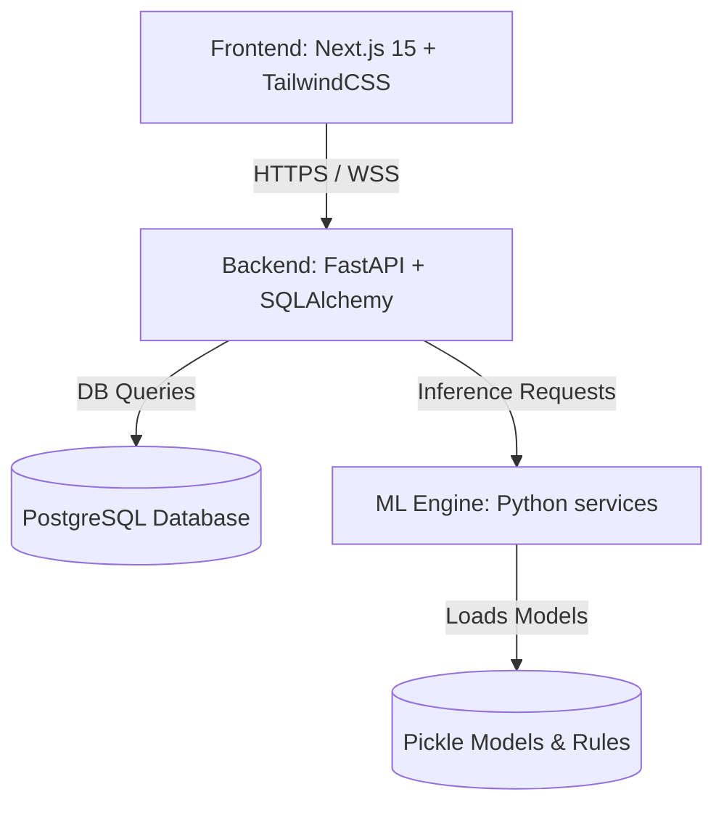

# MoneyMindX 🧠💼

MoneyMindX is a next-generation AI-powered personal financial intelligence and wealth simulation platform. It blends traditional personal finance tracking (expenses, budgets, goals) with advanced machine learning engines that evaluate your financial stress score, map your financial personality DNA, and run multi-scenario wealth simulations.

## Project Architecture Overview

## Structure & Tech Stack

### 1. Frontend (`frontend/`)
- **Framework**: Next.js 15 (React 19, TailwindCSS, ShadCN UI)
- **Visuals**: Recharts for dynamic financial graphing, customized HSL color palette
- **Store**: Zustand/custom stores for global app state
- **Services**: Custom API fetch client with token handling

### 2. Backend (`backend/`)
- **Framework**: FastAPI (Python 3.10+)
- **ORM**: SQLAlchemy + PostgreSQL
- **Security**: JWT token authentication with bcrypt password hashing
- **Key Modules**: API routes, models, schemas, repositories, and middleware (rate limiting & auth)

### 3. ML Engine (`ml-engine/`)
- **Recommendation Engine**: Custom logic and trained model for personalized financial insights.
- **Spending Pattern Engine**: Clustering and pattern detection algorithms.
- **Personality DNA Engine**: Dynamic classification based on spending archetype rules.
- **Stress Engine**: Multi-indicator financial stress score calculator.
- **Wealth Simulator**: Compound interest and scenario-based simulation generator.

### 4. Database (`database/`)
- Contains schemas, seed data, and historical backups.

### 5. Deployment (`deployment/`)
- Production Dockerfiles, Nginx configurations, and CI/CD pipelines.
