# MoneyMind X - User Flow Documentation

This document outlines the user interaction paths, system responses, and operational exit conditions for **MoneyMind X**. Every flow is detailed chronologically and mapped with a Mermaid flowchart diagram.

---

## Table of Contents
1. [User Registration](#1-user-registration)
2. [Login](#2-login)
3. [Add Expense](#3-add-expense)
4. [Create Budget](#4-create-budget)
5. [Create Financial Goal](#5-create-financial-goal)
6. [View Dashboard](#6-view-dashboard)
7. [AI Recommendations](#7-ai-recommendations)
8. [Wealth Simulator](#8-wealth-simulator)
9. [Financial Personality DNA](#9-financial-personality-dna)
10. [Financial Stress Score](#10-financial-stress-score)
11. [AI Chat Assistant](#11-ai-chat-assistant)

---

## 1. User Registration

* **Entry Point:** Landing page, top navigation bar button labeled `"Register"`.
* **Steps:**
  1. User lands on registration screen.
  2. Input full name, email, and password.
  3. Click `"Create Account"`.
  4. System processes validation checks.
* **User Actions:** Inputs values and submits the registration form.
* **System Actions:** Sends `POST /auth/register` to backend, hashes the password via bcrypt, stores records in PostgreSQL database, and responds with a success status or validation errors.
* **Exit Conditions:** Redirects to the login screen on success; highlights input errors on failure.

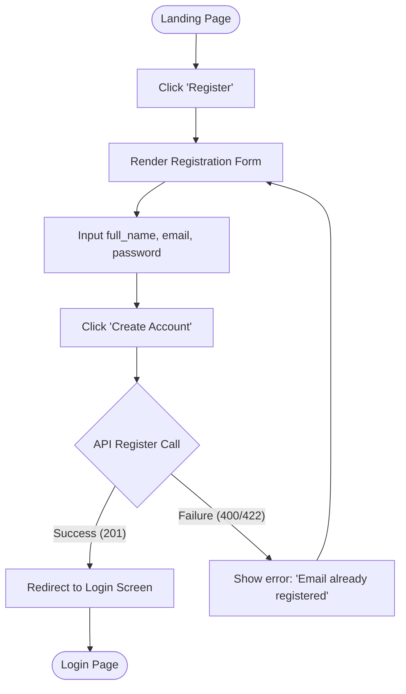

---

## 2. Login

* **Entry Point:** Landing page navigation button labeled `"Login"`.
* **Steps:**
  1. User lands on login screen.
  2. Input email and password.
  3. Click `"Login"`.
  4. System issues and caches authentication credentials.
* **User Actions:** Inputs credentials and clicks submit.
* **System Actions:** Transmits `POST /auth/login`, matches credentials, generates JWT access and refresh tokens, and saves them in browser cookies/local stores.
* **Exit Conditions:** Land on the main dashboard; show credentials warning on failure.

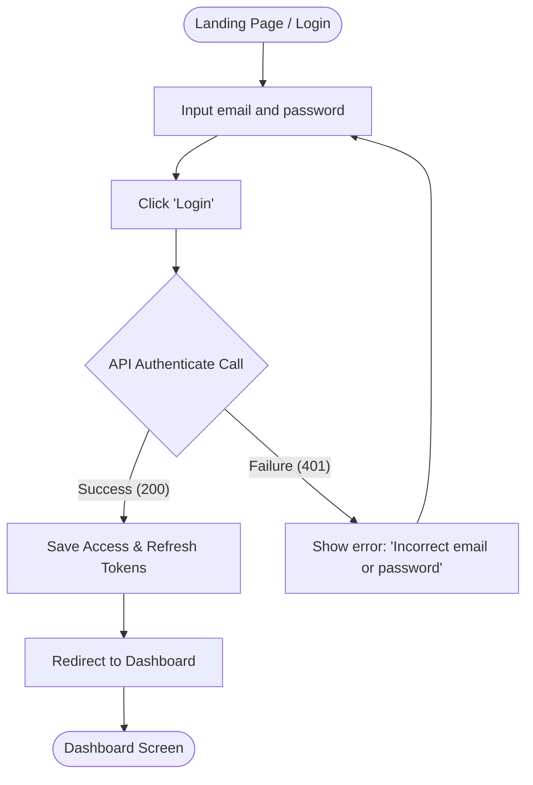

---

## 3. Add Expense

* **Entry Point:** Dashboard view, floating action button labeled `"+ Add Expense"`.
* **Steps:**
  1. Click trigger button.
  2. Open the slide-out modal form.
  3. Input amount, select category, pick date, and type description.
  4. Click `"Save Expense"`.
* **User Actions:** Fills out numeric fields, category dropdown, date select, and clicks submit.
* **System Actions:** Validates properties (e.g. amount > 0), sends `POST /expenses` to the backend, logs record, calculates category budget progress, and updates the local state query caches.
* **Exit Conditions:** Toast notification confirms creation, modal closes, and dashboard metrics refresh.

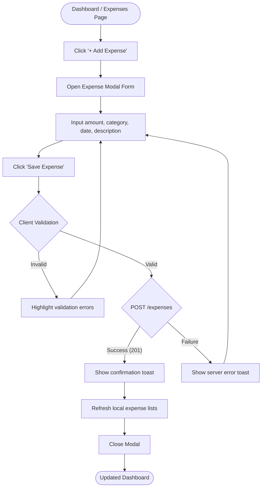

---

## 4. Create Budget

* **Entry Point:** Side navigation bar tab labeled `"Budgets"`.
* **Steps:**
  1. User navigates to budget setup section.
  2. Click `"Set Budget Limit"`.
  3. Select category and define the maximum monthly spend limit.
  4. Click `"Save Budget"`.
* **User Actions:** Selects category from dropdown and types limit.
* **System Actions:** Sends `POST /budgets` to backend, checks unique composite constraint `(user_id, category)` in Postgres, and inserts the budget row.
* **Exit Conditions:** Budget card displays in active budget limits list.

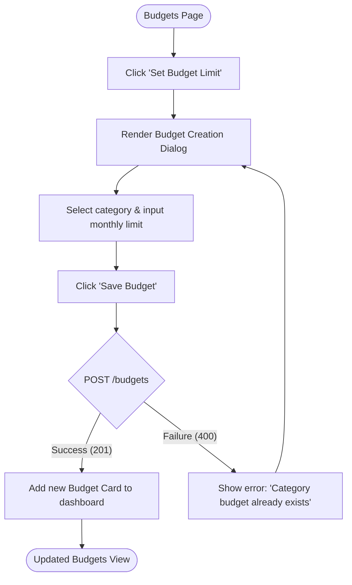

---

## 5. Create Financial Goal

* **Entry Point:** Side navigation tab labeled `"Savings Goals"`.
* **Steps:**
  1. Click `"New Goal"`.
  2. Input name, target amount, starting balance, and target date.
  3. Click `"Create Goal"`.
* **User Actions:** Inputs name, target numeric value, optional current balance, and date.
* **System Actions:** Sends `POST /goals`, validates date parameters (must be in the future), calculates progress percentage, and stores goal.
* **Exit Conditions:** Goal card displays with calculated progress bar.

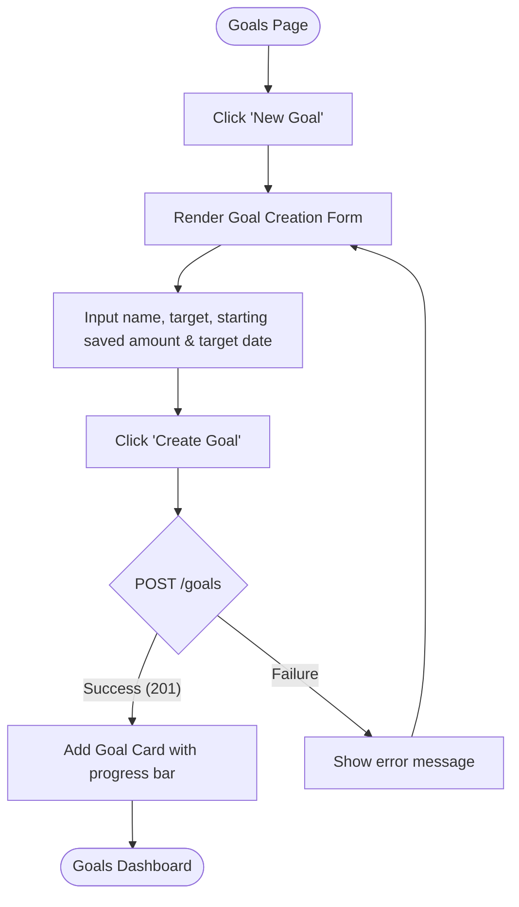

---

## 6. View Dashboard

* **Entry Point:** Post-login redirection or header click labeled `"Dashboard"`.
* **Steps:**
  1. System checks for a valid authentication session.
  2. Request user metrics from backend.
  3. Load dashboard visuals.
* **User Actions:** Observes metrics, clicks charts to inspect specific categories.
* **System Actions:** Calls endpoints `GET /expenses`, `GET /budgets`, `GET /goals` in parallel, maps responses to charts, checks budget thresholds, and serves pending alerts.
* **Exit Conditions:** Full dashboard rendered with interactive metrics.

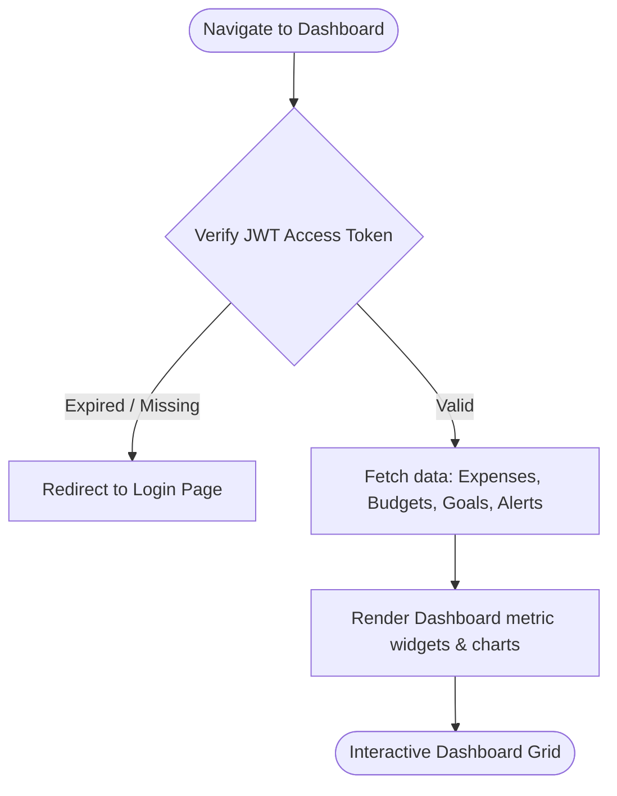

---

## 7. AI Recommendations

* **Entry Point:** Side navigation tab labeled `"Recommendations"`.
* **Steps:**
  1. User navigates to Recommendations page.
  2. System fetches saving insights dynamically or lists pre-calculated tips.
  3. User reviews recommendations (possible savings, confidence, severity).
  4. User clicks `"Accept"`, `"Dismiss"`, or `"Apply"`.
* **User Actions:** Navigates the recommendations grid and updates item statuses.
* **System Actions:** Calls `GET /recommendations` to display list, and updates status values using `PUT /recommendations/{id}/status`.
* **Exit Conditions:** Recommendation cards are updated or cleared.

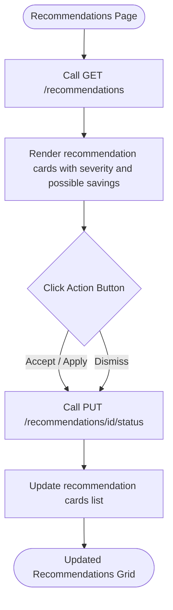

---

## 8. Wealth Simulator

* **Entry Point:** Navigation tab labeled `"Wealth Simulator"`.
* **Steps:**
  1. User navigates to Wealth Simulator page.
  2. Input starting net worth, expected rate of return, inflation rate, and monthly deposits.
  3. Click `"Calculate Projections"`.
  4. System processes data and plots scenarios.
* **User Actions:** Inputs variables or adjusts sliders and triggers calculation.
* **System Actions:** Transmits `POST /simulator/run`, runs compounding formulas, calculates nominal vs. inflation-adjusted values, and returns yearly projections.
* **Exit Conditions:** Renders interactive multi-line chart projections and summary metrics.

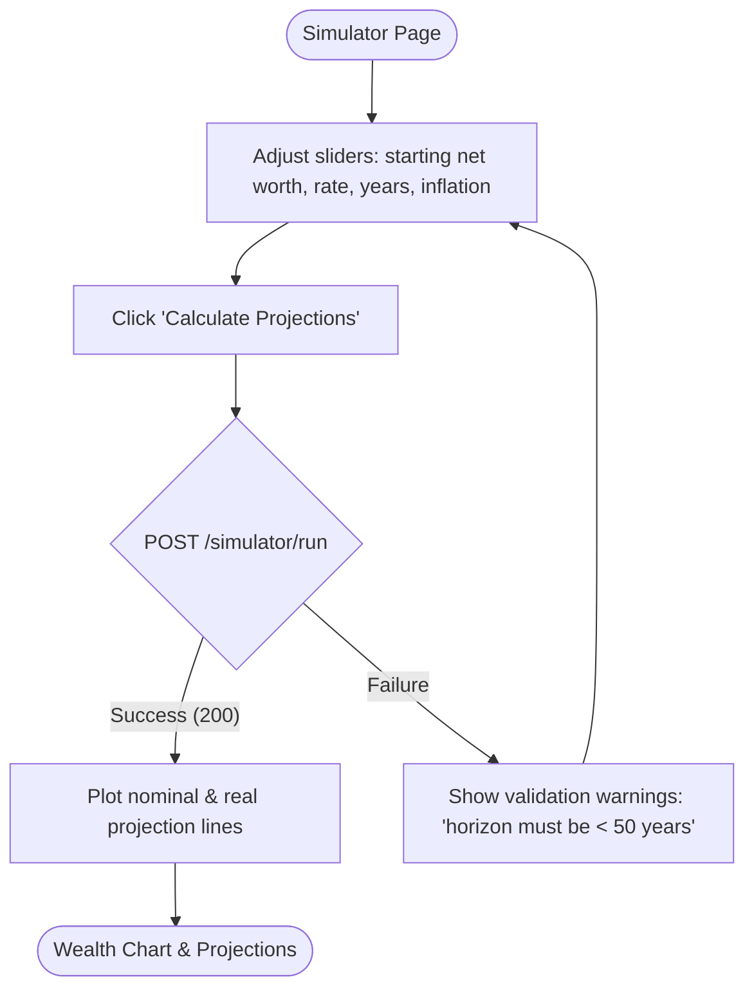

---

## 9. Financial Personality DNA

* **Entry Point:** Side navigation tab labeled `"Personality Quiz"`.
* **Steps:**
  1. Navigates to quiz page and reads instructions.
  2. Click `"Start Quiz"`.
  3. Answer 10 multiple-choice questions.
  4. Click `"Submit Assessment"`.
  5. System processes choices and displays archetype.
* **User Actions:** Selects answers to behavioral questions and submits the quiz.
* **System Actions:** Sends `POST /personality/assess`, matches answers to money personas (e.g. Strategic Builder), saves profile in database, and renders result page.
* **Exit Conditions:** Result page details personality archetype, strengths, weaknesses, and compatibility tips.

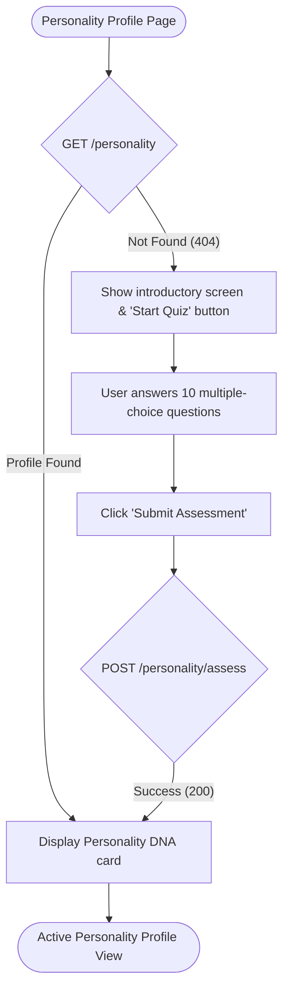

---

## 10. Financial Stress Score

* **Entry Point:** Side navigation tab labeled `"Stress Score"`.
* **Steps:**
  1. User navigates to Stress Score section.
  2. Input fixed debt payments and dependent count, and toggle income stability.
  3. Click `"Calculate Stress Score"`.
  4. System displays stress score dashboard.
* **User Actions:** Completes questionnaire inputs and clicks submit.
* **System Actions:** Sends `POST /stress/assess`, pulls database parameters (expenses, savings rate), scores stress from 0 to 100, and returns categories (Low, Moderate, High, Severe) with actionable steps.
* **Exit Conditions:** Stress index gauges and mitigation check-lists render.

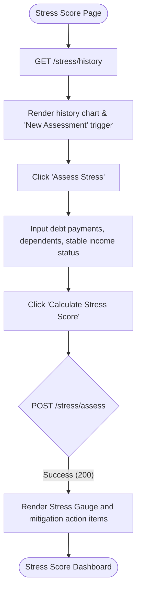

---

## 11. AI Chat Assistant

* **Entry Point:** Floating chat widget in bottom right corner, or side navigation tab labeled `"AI Assistant"`.
* **Steps:**
  1. User opens chat widget/page.
  2. System renders historical messages (if session exists).
  3. User types financial query in input field and hits Send.
  4. System displays query, calls AI endpoint, and streams response.
* **User Actions:** Selects assistant type (General or Investment Helper), types queries, and views responses.
* **System Actions:** Posts query to `POST /chat` or `POST /investment-assistant/chat`, verifies rate limits (SlowAPI), streams responses, and logs transaction message history.
* **Exit Conditions:** Conversation completed; user minimizes widget or navigates away.

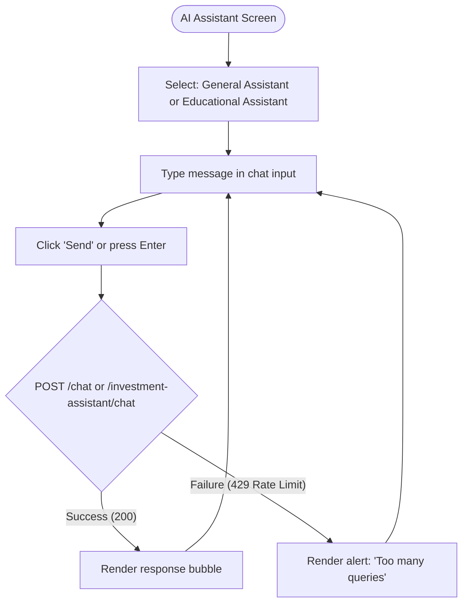
